<div align="center">
  <a href="https://weather.rares-andrei.me">
    
  </a>
        <h3 align="center">Weather App</h3>
</div>

## About Project

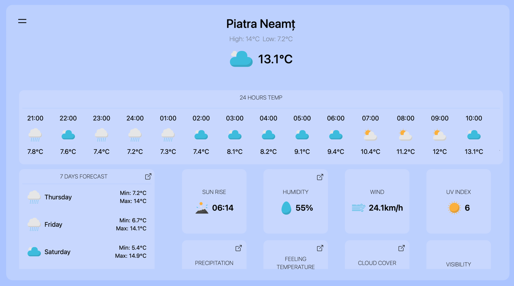

Weather App is a user-friendly and versatile weather application designed to provide accurate weather information to users in a simple and easy-to-understand format. Whether you're a weather enthusiast, planning outdoor activities, or just want to stay informed about the current weather conditions, Weather App has got you covered.

### Technologies used

-   The JavaScript library used is [React.js](https://reactjs.org/docs/getting-started.html) supported by the framework [Next.js](https://nextjs.org/docs)
-   The component library is called [Headless UI](https://headlessui.com)
-   The CSS library used is [Tailwind CSS](https://tailwindcss.com)
-   Charts were made using [Charts.js](https://www.chartjs.org)
-   Icons were created by [Petai Jantrapoon](https://iconscout.com/icon-pack/weather-forecast-outline-flat), and supplemented by [Cerbu Ionut](https://www.instagram.com/oshikv_/)
-   The Progressive Web App (PWA) was created with [Next-PWA](https://www.npmjs.com/package/next-pwa)
-   API data is fetched using [SWR](https://swr.vercel.app)
-   The weather information is fetched from the [Open-Meteo](https://open-meteo.com) API.
-   The city names are retrieved using the [Open Weather Map](https://openweathermap.org) API.

## Proper Usage on Apple Devices
To properly run the application on Safari, you need to grant location access from the settings.

### IOS:
1. Go to "Settings" 
2. Tap on "Privacy & Security"
3. Select "Location Services"
4. Look for "Safari Websites"
5. Under "Allow Location Access" section, choose "While Using the App"

### MacOS:
1. Go to "Settings"
2. Click on "Privacy & Security"
3. Select "Location Services"
4. Look for "Safari" and enable location access.

## Installation

1. Clone the Project

```sh
git clone https://github.com/rsh1337/weather-app
```

2. Install NPM Packages

```sh
npm install
```

3. Create a .env file in the root folder of the project and add the [Open Weather Map](https://openweathermap.org) API key

```
OPENWEATHERKEY="KEY"
```

4. Build the Project

```sh
npm run build
```

5. Start the Project

```sh
npm run start
```

6. Access the website

```
http://localhost:3007
```

## Usage

Access https://weather.rares-andrei.me

### Homepage


If we accept the location access, we will receive information and details about our current location.

#### On this page, at first glance, we can see the following information:

- The maximum and minimum temperature of the day
- The current temperature and an icon indicating the weather conditions (clear, rainy, etc.)
- The temperature throughout the day, divided by hour, with temperature and weather icon
- Weather forecast for the next 7 days, including maximum and minimum temperature, as well as an icon indicating the weather conditions
- 8 boxes containing information about: sunrise time, humidity, wind speed, UV rays, precipitation, feels-like temperature, cloud coverage percentage, and visibility, all for the current moment

### 7 Days Forecast Section

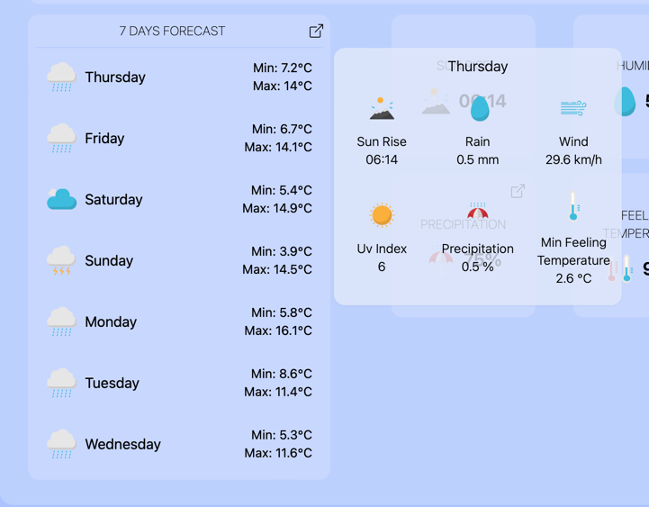

In this section, we receive information about each day individually, such as:

- Sunrise time for that day
- Amount of precipitation in millimeters
- Wind speed
- UV rays
- Chance of precipitation
- Minimum temperature, which will be felt on that day

### Details Section for Boxes

In 4 out of the 8 boxes, specifically in the boxes about humidity, precipitation, feels like temperature, and cloud cover, we find a chart with information for the current day (24 hours).

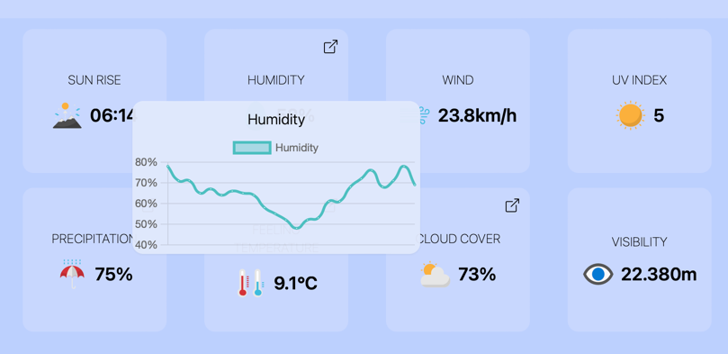
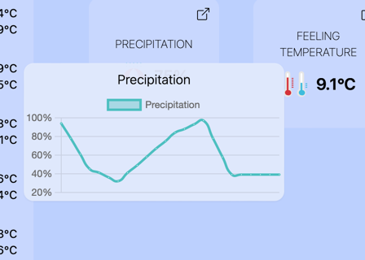
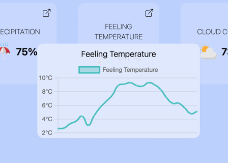
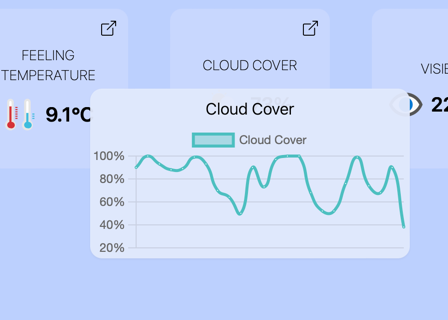


### Sidebar

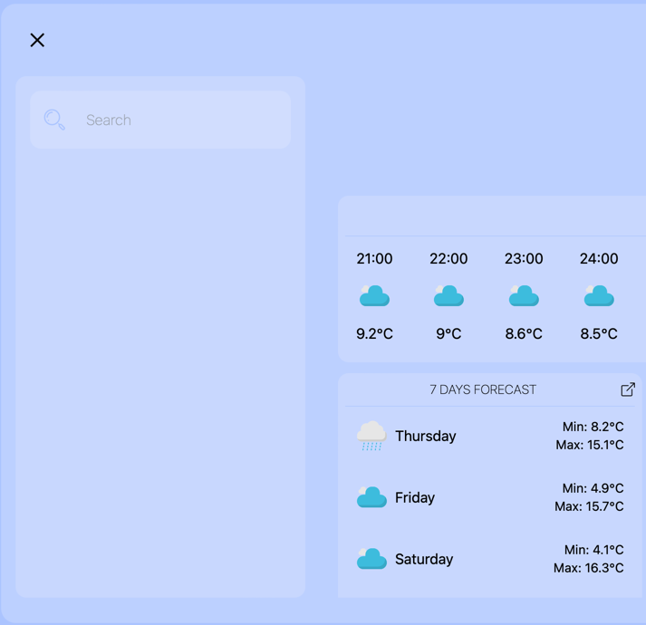

In the sidebar, we can search for other cities, and here the saved city information will be stored, such as:

- current temperature
- maximum temperature
- minimum temperature

We can also access the saved cities in the sidebar with just one click on them.

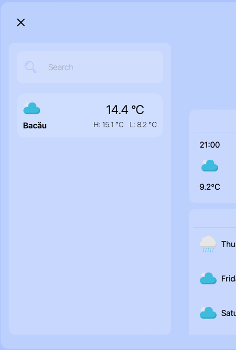

### Searched City

On this page, we have all the information that we have on the homepage, with the addition of a star in the top right corner. The star is filled when the city is saved, and only the outline when the city is not saved.
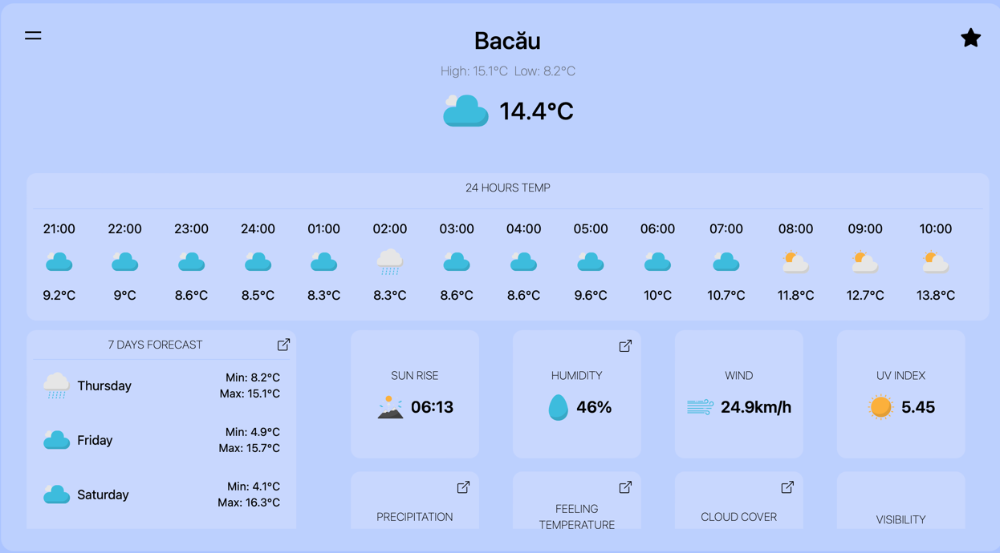
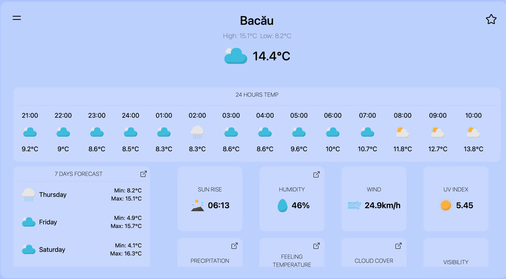

## Mobile Support

All the features mentioned above are also available on mobile devices.

#### Popup for suggesting PWA installation on iOS

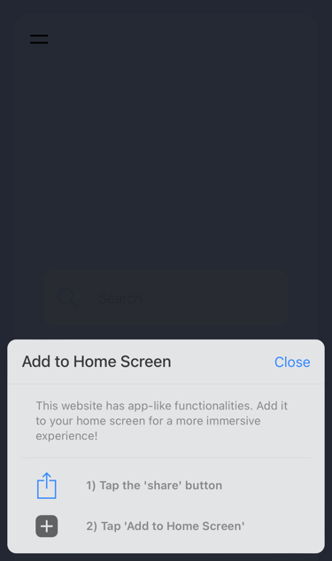

#### Homepage

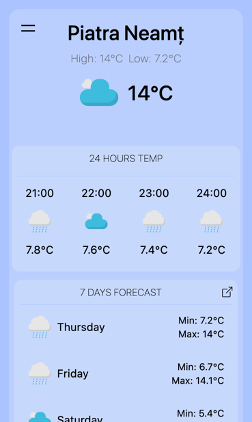

#### 7-day forecast details

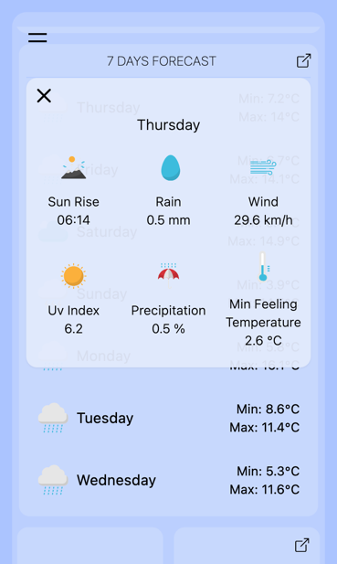

#### Box details

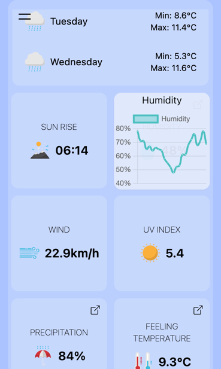

#### Search city results with filled and empty stars

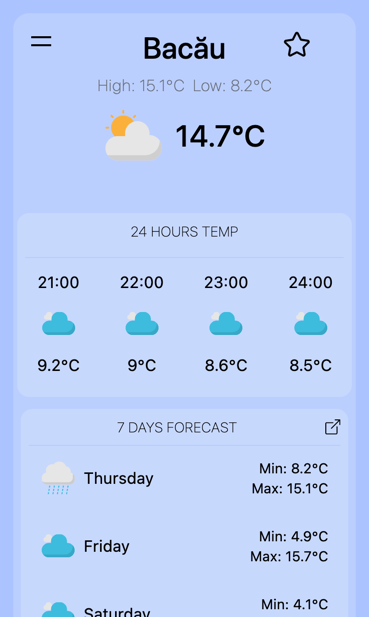

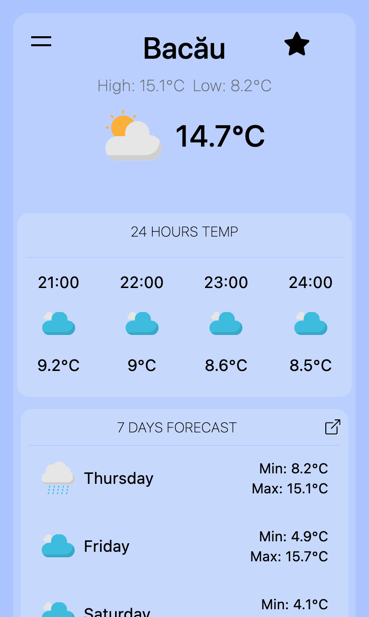

#### Sidebar with saved cities

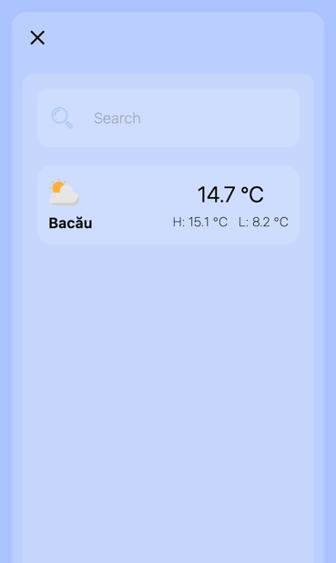
